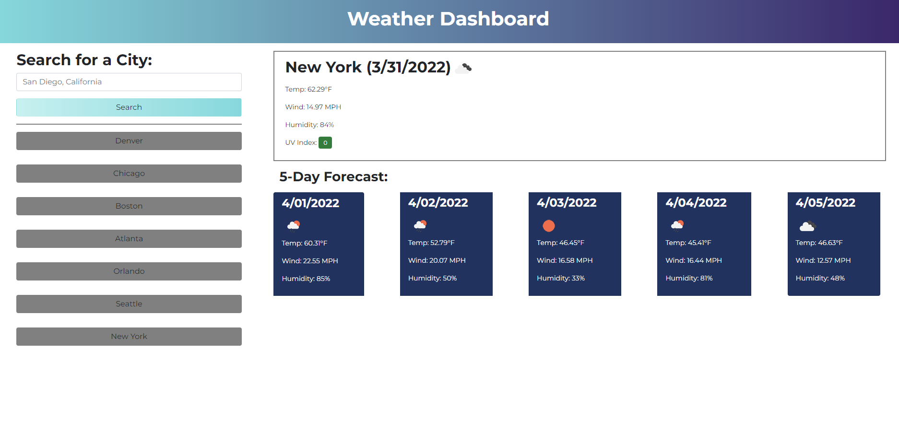

# Weather Dashboard

## If you're an avid traveler, use this weather dashboard to check the weather of your destination    

### Developed as a challenge for the Rutgers Coding Bootcamp, this web app makes use of the openweather server-side api    

[Link to application](https://kgil60.github.io/weather-dashboard/)    

 
Preview of weather dashboard    

Built with HTML, CSS, and JavaScript